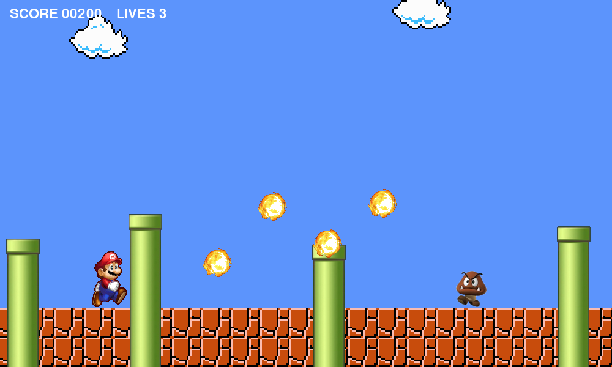

# Mario Game

A small **Mario-style platformer** written in Python with [pygame](https://www.pygame.org):
run, jump, stomp goombas, throw bouncing fireballs, and reach the end of the level —
with a score, lives, and a win/game-over screen.

<p align="center">
  
</p>

## Controls

| Key | Action |
| --- | ------ |
| ← → | run |
| Space / ↑ | jump |
| Left-Ctrl / F | throw a fireball |
| R | restart (after winning or losing) |
| Esc | quit |

## Rules

- **Stomp** a goomba (land on it from above) to squash it: +100 points and a bounce.
- **Burn** a goomba with a fireball: +100 points; it smolders briefly, then despawns.
- Touch a goomba any other way and you **lose a life** (with a moment of flashing
  invincibility). Three hits and it's game over.
- Goombas patrol and turn around at tubes and level edges. Tubes are solid from every
  side — stand on them, or get blocked by them.
- Reach the end of the level to **win**.

## Run it

Requires Python 3.10+.

```bash
python -m venv .venv && source .venv/bin/activate
pip install -r requirements.txt
python mario.py
```

## Tests

The world model (physics, collisions, scoring, lives, win/lose) is separated from
rendering, so it's tested headlessly:

```bash
python -m unittest discover -s tests
```

18 tests cover stomping vs. side contact, invincibility frames, fireball burn +
cooldown, tube collision from all sides, goomba patrolling, sprite cleanup, win/lose
transitions, restart, and camera clamping.

## Project structure

```
mario.py             # the game: sprites, model (world rules), view, controller
tests/test_game.py   # headless model tests
assets/              # README screenshot
*.png                # sprites: mario walk cycle, goomba, tube, fireball, background
requirements.txt
```

## License

MIT. Mario artwork belongs to Nintendo; the sprites here are used for a
non-commercial hobby project.
